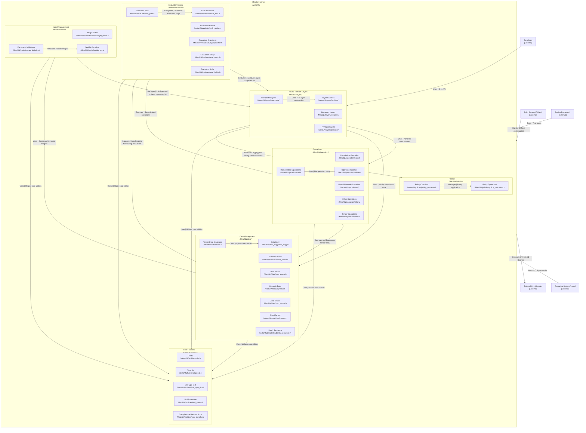

# Unnamed CodeViz Diagram

```mermaid
graph TD

    developer["Developer<br>[External]"]
    build_system["Build System (CMake)<br>[External]"]
    testing_framework["Testing Framework<br>[External]"]
    operating_system["Operating System (Linux)<br>[External]"]
    external_libraries["External C++ Libraries<br>[External]"]
    subgraph metann_library_boundary["MetaNN Library<br>/MetaNN/"]
        subgraph data_management_boundary["Data Management<br>/MetaNN/data/"]
            tensor_data["Tensor Data Structures<br>/MetaNN/data/tensor.h"]
            scalable_tensor["Scalable Tensor<br>/MetaNN/data/scalable_tensor.h"]
            bias_vector["Bias Vector<br>/MetaNN/data/bias_vector.h"]
            dynamic_data["Dynamic Data<br>/MetaNN/data/dynamic.h"]
            zero_tensor["Zero Tensor<br>/MetaNN/data/zero_tensor.h"]
            trivial_tensor["Trivial Tensor<br>/MetaNN/data/trivial_tensor.h"]
            batch_sequence["Batch Sequence<br>/MetaNN/data/batch/batch_sequence.h"]
            data_copy_comp["Data Copy<br>/MetaNN/data_copy/data_copy.h"]
            %% Edges at this level (grouped by source)
            tensor_data["Tensor Data Structures<br>/MetaNN/data/tensor.h"] -->|"Used by | For data transfer"| data_copy_comp["Data Copy<br>/MetaNN/data_copy/data_copy.h"]
        end
        subgraph evaluation_engine_boundary["Evaluation Engine<br>/MetaNN/evaluate/"]
            eval_plan["Evaluation Plan<br>/MetaNN/evaluate/eval_plan.h"]
            eval_handle["Evaluation Handle<br>/MetaNN/evaluate/eval_handle.h"]
            eval_dispatcher["Evaluation Dispatcher<br>/MetaNN/evaluate/eval_dispatcher.h"]
            eval_group["Evaluation Group<br>/MetaNN/evaluate/eval_group.h"]
            eval_item["Evaluation Item<br>/MetaNN/evaluate/eval_item.h"]
            eval_buffer["Evaluation Buffer<br>/MetaNN/evaluate/eval_buffer.h"]
            %% Edges at this level (grouped by source)
            eval_plan["Evaluation Plan<br>/MetaNN/evaluate/eval_plan.h"] -->|"Comprises | Individual evaluation steps"| eval_item["Evaluation Item<br>/MetaNN/evaluate/eval_item.h"]
        end
        subgraph core_facilities_boundary["Core Facilities<br>/MetaNN/facilities/"]
            facilities_traits["Traits<br>/MetaNN/facilities/traits.h"]
            type_id["Type ID<br>/MetaNN/facilities/type_id.h"]
            var_type_dict["Var Type Dict<br>/MetaNN/facilities/var_type_dict.h"]
            null_param["Null Parameter<br>/MetaNN/facilities/null_param.h"]
            cont_metafuns["Compile-time Metafunctions<br>/MetaNN/facilities/cont_metafuns/"]
        end
        subgraph nn_layers_boundary["Neural Network Layers<br>/MetaNN/layers/"]
            composite_layers["Composite Layers<br>/MetaNN/layers/composite/"]
            recurrent_layers["Recurrent Layers<br>/MetaNN/layers/recurrent/"]
            layer_facilities["Layer Facilities<br>/MetaNN/layers/facilities/"]
            principal_layers["Principal Layers<br>/MetaNN/layers/principal/"]
            %% Edges at this level (grouped by source)
            composite_layers["Composite Layers<br>/MetaNN/layers/composite/"] -->|"Uses | For layer construction"| layer_facilities["Layer Facilities<br>/MetaNN/layers/facilities/"]
        end
        subgraph model_management_boundary["Model Management<br>/MetaNN/model/"]
            weight_buffer["Weight Buffer<br>/MetaNN/model/facilities/weight_buffer.h"]
            param_initializer["Parameter Initializers<br>/MetaNN/model/param_initializer/"]
            weight_container["Weight Container<br>/MetaNN/model/weight_cont/"]
            %% Edges at this level (grouped by source)
            param_initializer["Parameter Initializers<br>/MetaNN/model/param_initializer/"] -->|"Initializes | Model weights"| weight_container["Weight Container<br>/MetaNN/model/weight_cont/"]
        end
        subgraph operations_boundary["Operations<br>/MetaNN/operation/"]
            conv_op["Convolution Operation<br>/MetaNN/operation/conv.h"]
            math_ops["Mathematical Operations<br>/MetaNN/operation/math/"]
            nn_ops["Neural Network Operations<br>/MetaNN/operation/nn/"]
            other_ops["Other Operations<br>/MetaNN/operation/others/"]
            tensor_ops["Tensor Operations<br>/MetaNN/operation/tensor/"]
            operation_facilities["Operation Facilities<br>/MetaNN/operation/facilities/"]
            %% Edges at this level (grouped by source)
            math_ops["Mathematical Operations<br>/MetaNN/operation/math/"] -->|"Uses | For operation setup"| operation_facilities["Operation Facilities<br>/MetaNN/operation/facilities/"]
        end
        subgraph policies_boundary["Policies<br>/MetaNN/policies/"]
            policy_container["Policy Container<br>/MetaNN/policies/policy_container.h"]
            policy_operations["Policy Operations<br>/MetaNN/policies/policy_operations.h"]
            %% Edges at this level (grouped by source)
            policy_container["Policy Container<br>/MetaNN/policies/policy_container.h"] -->|"Manages | Policy application"| policy_operations["Policy Operations<br>/MetaNN/policies/policy_operations.h"]
        end
        %% Edges at this level (grouped by source)
        nn_layers_boundary["Neural Network Layers<br>/MetaNN/layers/"] -->|"Uses | Performs computations"| operations_boundary["Operations<br>/MetaNN/operation/"]
        nn_layers_boundary["Neural Network Layers<br>/MetaNN/layers/"] -->|"Uses | Manipulates tensor data"| data_management_boundary["Data Management<br>/MetaNN/data/"]
        nn_layers_boundary["Neural Network Layers<br>/MetaNN/layers/"] -->|"Uses | Utilizes core utilities"| core_facilities_boundary["Core Facilities<br>/MetaNN/facilities/"]
        nn_layers_boundary["Neural Network Layers<br>/MetaNN/layers/"] -->|"Influenced by | Applies configurable behaviors"| policies_boundary["Policies<br>/MetaNN/policies/"]
        model_management_boundary["Model Management<br>/MetaNN/model/"] -->|"Manages | Initializes and updates layer weights"| nn_layers_boundary["Neural Network Layers<br>/MetaNN/layers/"]
        model_management_boundary["Model Management<br>/MetaNN/model/"] -->|"Uses | Stores and retrieves weights"| data_management_boundary["Data Management<br>/MetaNN/data/"]
        model_management_boundary["Model Management<br>/MetaNN/model/"] -->|"Uses | Utilizes core utilities"| core_facilities_boundary["Core Facilities<br>/MetaNN/facilities/"]
        evaluation_engine_boundary["Evaluation Engine<br>/MetaNN/evaluate/"] -->|"Evaluates | Executes layer computations"| nn_layers_boundary["Neural Network Layers<br>/MetaNN/layers/"]
        evaluation_engine_boundary["Evaluation Engine<br>/MetaNN/evaluate/"] -->|"Executes | Runs defined operations"| operations_boundary["Operations<br>/MetaNN/operation/"]
        evaluation_engine_boundary["Evaluation Engine<br>/MetaNN/evaluate/"] -->|"Manages | Handles data flow during evaluation"| data_management_boundary["Data Management<br>/MetaNN/data/"]
        evaluation_engine_boundary["Evaluation Engine<br>/MetaNN/evaluate/"] -->|"Uses | Utilizes core utilities"| core_facilities_boundary["Core Facilities<br>/MetaNN/facilities/"]
        operations_boundary["Operations<br>/MetaNN/operation/"] -->|"Operates on | Processes tensor data"| data_management_boundary["Data Management<br>/MetaNN/data/"]
        operations_boundary["Operations<br>/MetaNN/operation/"] -->|"Uses | Utilizes core utilities"| core_facilities_boundary["Core Facilities<br>/MetaNN/facilities/"]
        data_management_boundary["Data Management<br>/MetaNN/data/"] -->|"Uses | Utilizes core utilities"| core_facilities_boundary["Core Facilities<br>/MetaNN/facilities/"]
    end
    %% Edges at this level (grouped by source)
    developer["Developer<br>[External]"] -->|"Uses | C++ API"| nn_layers_boundary["Neural Network Layers<br>/MetaNN/layers/"]
    build_system["Build System (CMake)<br>[External]"] -->|"Builds | CMake configuration"| metann_library_boundary["MetaNN Library<br>/MetaNN/"]
    testing_framework["Testing Framework<br>[External]"] -->|"Tests | Test cases"| metann_library_boundary["MetaNN Library<br>/MetaNN/"]
    metann_library_boundary["MetaNN Library<br>/MetaNN/"] -->|"Runs on | System calls"| operating_system["Operating System (Linux)<br>[External]"]
    metann_library_boundary["MetaNN Library<br>/MetaNN/"] -->|"Depends on | Linked libraries"| external_libraries["External C++ Libraries<br>[External]"]

```
---
*Generated by [CodeViz.ai](https://codeviz.ai) on 10/25/2025, 10:46:34 PM*
